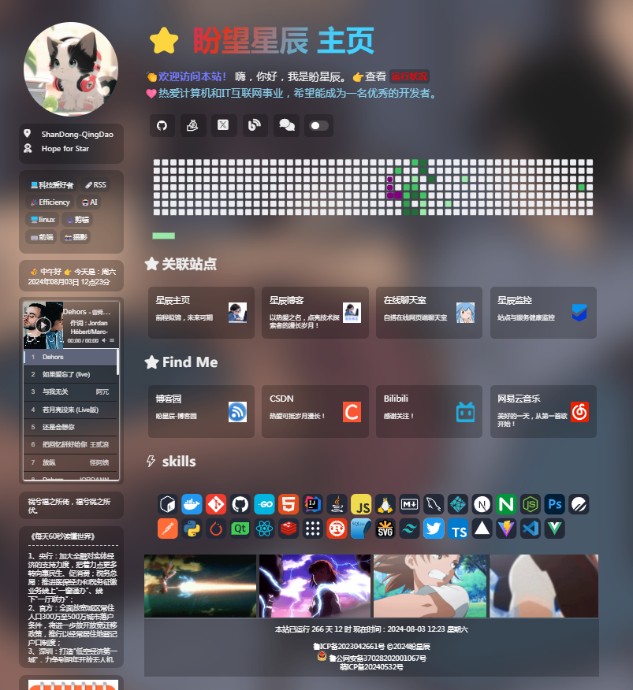
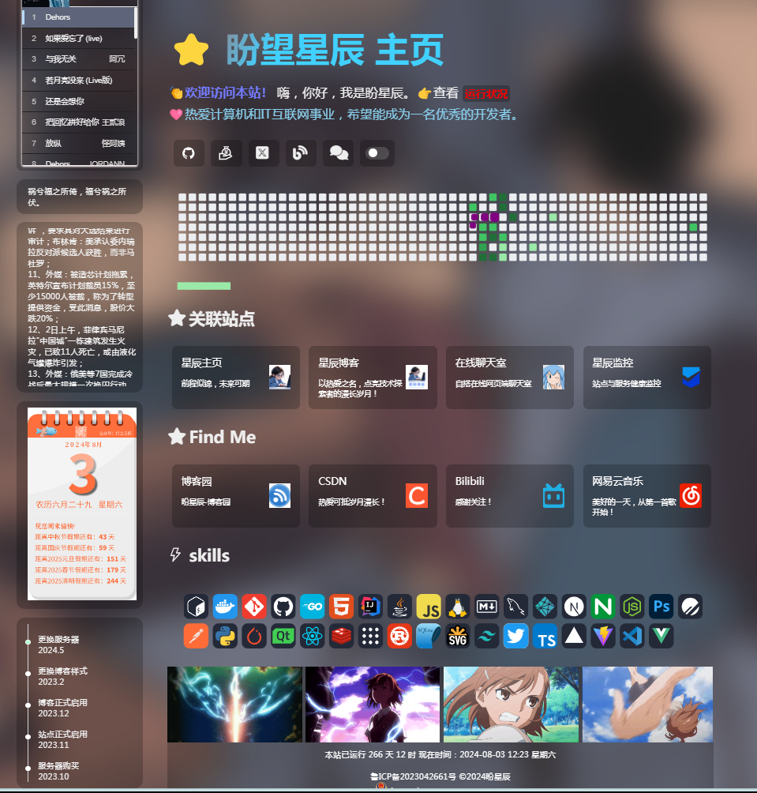
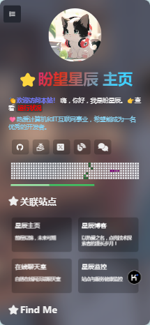
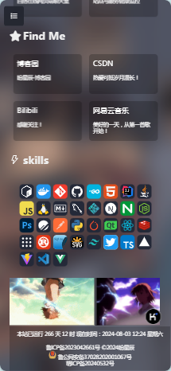
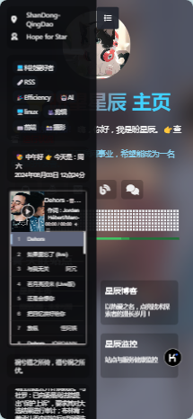
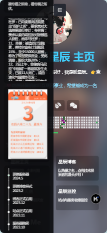

# 星辰主页HOMEPAGE

自定义优雅美观个人主页

首页演示：starchen.top

有什么问题和需求可以联系我的QQ号：1649364566

交流群：656991157

代码全面开源

# 介绍

首页代码可自定义修改。

添加github贪吃蛇，侧边栏添加音乐播放器、一言、《每天60秒读懂世界》、摸鱼日历、成长轨迹……

页面主题尾部添加gif动图，可展示兴趣爱好。

PC端添加滑动可调黑暗模式，可随意更改background背景图。

## 技术栈

html css js

# 思路来源

Noise-homepages和zyyo.cc

《每天60秒读懂世界》api来源：https://www.wudada.online/Api/ScD

随机一言api来源：https://v1.hitokoto.cn/?encode=js&select=%23hitokoto

摸鱼日历api来源：Https://dayu.qqsuu.cn/moyurili/apis.php

如何获取自己的github项目贪吃蛇：

可关注微信公众号：[盼望星辰](https://starchen.top/guanzhu.html)

也可进入我的博客获取教程[在github主页放一条贪吃蛇 – 星辰博客 (starchen.top)](https://blog.starchen.top/在github主页放一条贪吃蛇/)

获取教程

# 照片预览

## PC预览

## 手机预览

# 隐私问题

本主页免费开源，请勿进行非法出售！

# 备注

页面图标都是svg,可也自己找然后切换，gif也可自己找，然后替换！
